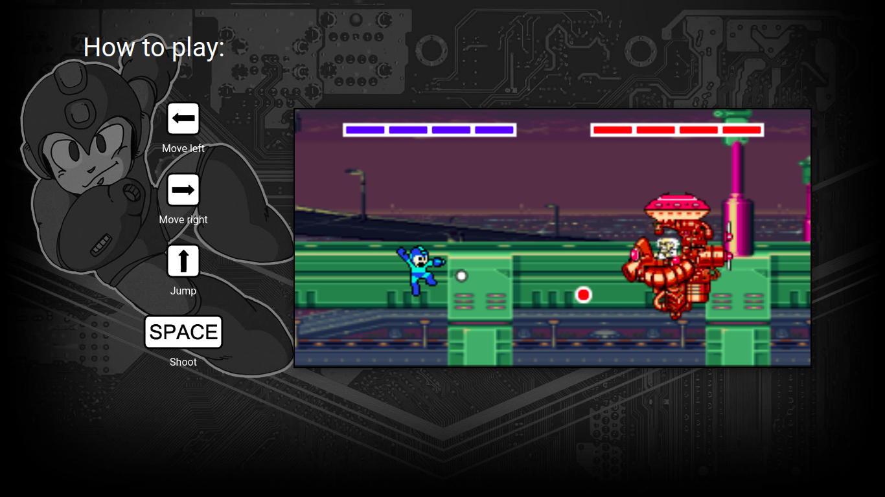

# Megaman

## Screenshots

  
## Installation
Clone or download this project, open the index.html file in your browser and have Fun.

## Usage example
Instructions to play this game:
* Press Enter key to start the game;
* Use arrow keys to avoid Dr. Wily shots;
* Use space bar key to shoot;
* Defeat Dr. Wily and bring peace to earth.

## Contributing
>This is a free software, feel free to contribute in any way you want

1. Fork it (<https://github.com/rickyalmeidadev/project-ironhack-game/fork>)
2. Create your feature branch (`git checkout -b feature/fooBar`)
3. Commit your changes (`git commit -am 'Add some fooBar'`)
4. Push to the branch (`git push origin feature/fooBar`)
5. Create a new Pull Request
